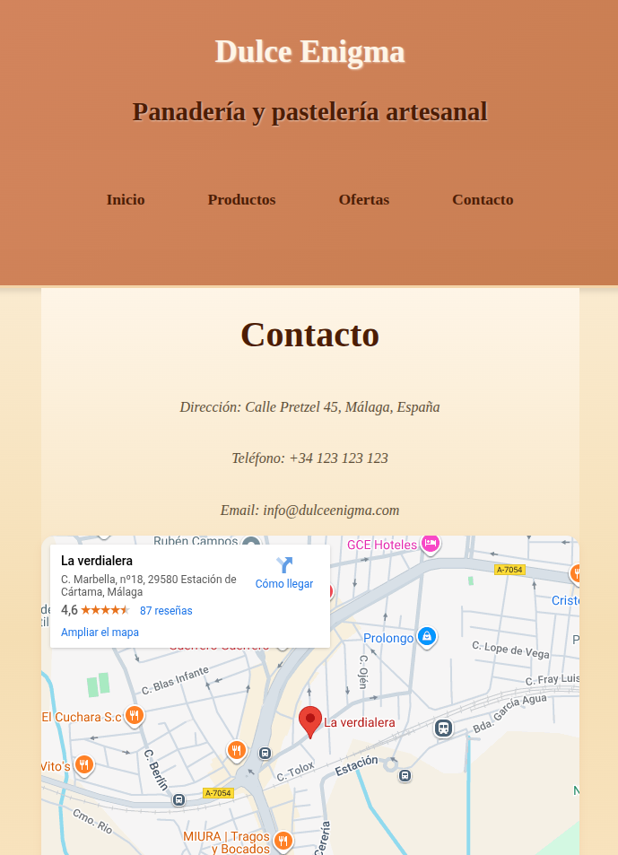

# Dulce Enigma — Panadería (Django)

Sitio web sencillo de una panadería con páginas públicas de **inicio**, **productos**, **ofertas** y **contacto**. El proyecto está pensado para demostración/portafolio y como base para añadir catálogo, panel de administración y funcionalidades e-commerce.

## 📦 Stack
- **Python 3.10+**
- **Django 4.2.x**
- **SQLite** por defecto (archivo `db.sqlite3`)
- Plantillas en **`templates/`** y estáticos en **`static/`**

## ✨ Funcionalidades
- Página de inicio con héroe/portada
- Listado de productos
- Sección de ofertas
- Página de contacto con datos de la tienda

## 🚀 Puesta en marcha (local)

```bash
# 1) Clonar y entrar
git clone <URL-DEL-REPO>
cd <carpeta-del-repo>

# 2) Entorno virtual
python3 -m venv .venv
source .venv/bin/activate

# 3) Dependencias
# Si existe requirements.txt:
pip install -r requirements.txt
# Si no, al menos:
pip install "Django>=4.2,<5"

# 4) Migraciones y arranque
python manage.py migrate
python manage.py runserver

```
## Capturas



